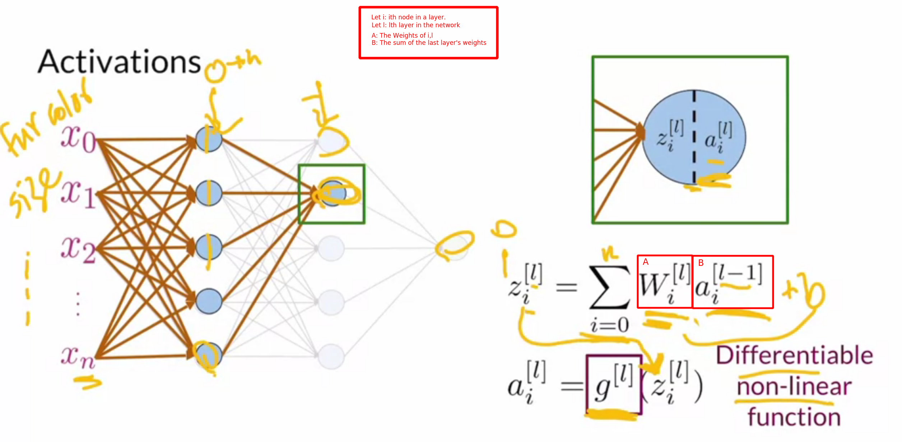
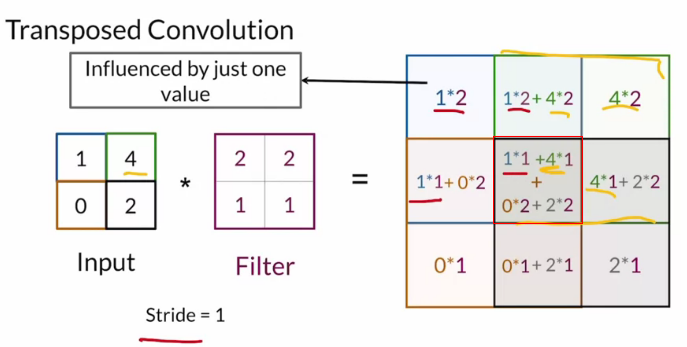
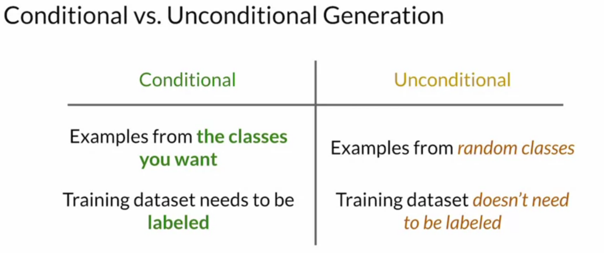

# Build Basic Generative Adversarial Networks (GANs)
## Sharon Zhou
## Eda Zhou
## Eric Zelikman

# Welcome to the Specialization
- GANs are some cutting edge technology used for emerging ideas.
- Some of them include:
    * Generating new people who never existed.
    * Generating images of yourself which are younger or older.
    * Generating sample images to increase rare category types.
- Implementing a GAN sounds hard but it really isn't; we'll implement one in the first week.
- A GAN is basically two competing Neural Networks: One which discriminates and one which creates.
- > You like something more if you build it yourself.
- For you to get the most out of this class: 
    * Must know what a Neural Network is.
    * Must know what a CNN is.
    * Must be comforrable with making models in python.
- **Generative Adversarial Models** is a type of **Generative Model**!
- **Descriminative Models** are which which select between categories: such as dogs and cats.
- **Generative Models*8 try to make a realistic represenation of an object.
- The model takes in a bunch of noise - and sometimes a class - to create a set of features.

- > Why can't we just tell it to generate the images of the category we want?
- We need this to ensure that it is not the same dog each time we ask for a new dog.
- We'll breifly touch on the most popular kinds of Generative models.
- One such model is the **Variational Autoencoder (VAE)** which tend to use an Encoder and a Decoder.
    - It takes latent representations and then pushes it through a Decoder.
    - This assumes the decoder is well trained already.
    - Once trained, we take the Encoder away and pull randomly from the latent space.
    - The "Variational" part injects some noise into this whole process.

- GANs are a bit different.
    - They're composed of two models as well.
    - Each model tries to on-up the other which is why they're called Adversarial.
    - At some point, we pull the *Generator* and simply insert random noise to create images.

- GANs have only been around since 2014.
- GANs can learn from anything that they are given so they're not limited to human faces.
- GANs can also do **Images Translation** aka from one domain to another.
- GANs can also generate 3D objects.
- Now we'e going to discusss the goals of the **Generator** and **Discriminator**.
- In the beginning, the *Generator* has no idea how to generate anything that looks real.
- The *Discriminator* gets the reals and the fakes jumbled together.

- There are better classes for understanding Neural Networks.
- For the Descriminator, instead of asking "what is this?" it instead asks "How fake is this?".
- The goal of the *Generator* is to generate examples of the class.

- Here is the BCE COst Function:

- No we'll look at the how to actaully train a GAN.
- After the first batch, the Discriminator is updated.
- After the next batch, the Generator is updated.
- **It is very important that both models be kept at similiar skill levels at the beginning of training.**
- This is because if the skill gap is too far apart then you can get perfect predictions and there is no growth.
- A common problem is for the *Discriminator* to improve too fast and then learning stops.

# Deep Convolutional GANs
- Now we're going to start peeking at the pieces to understand and improve the GANs.
- **Activations** take inputs (the **Domain**) and outputs a range from that input.
- These must have the requirements that they are:
    1. Non-linear.
    2. Differentiable.
- Looking at one of them as an example:

- It needs to be *Differentiable* because for backprobagation to work then you need to be able to create gradients.
- It needs to be *Non-Linear* otherwise the network would collapse into Linear Regression.
- > Linear Layers can be stacked on top of each other.
- There are a few common *Activations* which we're going to go over.
- The most common - and first - is **Rectified Linear Unit (ReLu)**.
- All it does is squash out all the negative values.

- While the derivative of Relu at 0 is technically undefined, in practice it simply is substituted as 0.
- Since the value at 0 is 0 then this can generate what is called the **Dying ReLu Problem**.
- Since the gradient is used to learning information a 0 means that nothing can ever be learned from this point again.
- To work around this, researchers have created **Leaky ReLu**:

- The derivative at 0 is still 0.
- Another function which is used is the **Sigmoid Activation Function**:

- This function is often used in the last layer for **Binary Classification**.
- It is very rare to find this in a *Hidden Layer* since the tails derivative approaches 0 causing the **Vanishing Gradient** problem.
- Another function is the **Hyperbolic Tangent Function**.

- An advantage here is that it keeps the sign of the `z`.
- It does have the same **Vanishing Gradient* problems though.
- Feel free to try to invent your own.
- GANs tend to be fragile.
- Therefore, anything that speeds up or stabilizes the training is going to be necessary.
- **Covariate Shift** is when the observed and trained data have different looking measured spaces.

- When you normalize the training data then it trains easier and faster:

- With all this in mind, Neural Networks are susceptible to **Internal Covariate Shift**.
- Basically, we see the same kind of misses internal to the hidden layers as we did in our pretend examples.
- **Batch Normalization** normalizes the inputs for each neuron.
- This has the added benefit of smoothing out the learning curve and speeding up training.
- A **Convolution** is a filter which tells you where features are in an image.

- They're really just an elemnt-wise product and sums.
- **Stride** just means "How many pixels do we move when we do a convolution".

- **Padding** is basically just a *frame* around the image you're using.

- **Pooling** is used to downsize the samples while **Upsampling** is used to increase it.
- *Pooling** basically reduces the images size and resolution:

- **Max Pooling** just takes the largest value from the seen observations.
- You can also see **Average Pooling** and **Min Pooling** as well.
- There are no parameters with this.
- For *Upsampling*, it increases the using inference about what it *should* look for.
- One common algorithm for this is **Nearest Neightbors Upsampling**:

- Other ways to do this are **Linear Interpolation** and **Bi-linear Interpolation**.
- **Transposed Convolution** is a process which creates a large image from a filter - like in convolutions:

- This creates a sort of *Checkerboard Pattern* in images which have been upsambled like this.

# Wasserstein GANs with Gradient Penalty
- Now we're going to deal with the problem of only generating a single output image.
- This is because the *Discriminator* gets stuck between images which are *really fake* and *really real*.
- Basically, if the *Generator* gets a good image through then it will stick to those features to be successful.
- This is because even though **Binary Cross Entropy** has an infinite number of values between 0 and 1, it approaches only one or the other as it gets further into training.
- A **Mode** in a distribution is just an area with a high concentration of values:

- **Mode Collapse** happens when the generator gets stuck in one mode of all the possible modes.
- This tug of war on the cost function is sometimes called the **Minimax Game**.
- Just going to post this image since it's perfect:

- It is quite common for the *Discriminator* to outperform the *Generator*.
- Now we're going to learn about the **Earth Mover's Distance** algorithm and why it solves the Vanishing Gradient Problem.
- It is a function of the amount of of distrance between the real and the fake distributions.
- The **W-Loss** approximates the *Earth Mover's Distance*.
- Since it's not longer bounded between 0 and 1, we now call the *Discrimiator* the *Critic*.

- The *Critic* has a constraint that the norm of the gradient should be at most 1 for every point.
- One way to make sure of this is called **Weight Clipping** where the weights are forced into a fixed interval.
- So, after *Gradient descent*, the weights are checked and clipped.
- This is not ideal since it limits the ability of the critic to learn and there for generator to create.
- The other way to do this is the **Gradient Penalty** which regularizes the critics gradients.

# Conditional GAN & Controllable Generation
- When you don't have a choice about what the GAN generates it is called **Uncontrolled Generation**.
- **Conditioned Generation** is where you specify what the model generates in contrast.

- Informing the  models of what you want is usually done via **One-Hot Encoding**.
- The input to the Generator of the GAN is a concatinated vector of the noise and one-hot encoding.
- The reason that you don't get random dogs is that the *Discriminator* also gets the class information.
- To get different outputs, we'll learn how to tweak the noise vector to get what we want:

- *Controllable Generation* and *Interpolation* are somewhat alike.
- Often, these are a *Linear Interpolation* but there are other kinds.

- In summary, you need to find the *Change in Direction (d)* to add to the noise to affect the features you want.
- **Feature Correlation** is when some features - such as a beard - are corelated with other features - such as a masculine face.
- And, if you want the beard but not the facial structure changes then there is a problem.
- You can also sometimes get **Z-Space Entanglement** where multple unrelated features will still be connected to one another:

- This is a common problem when the *Z-space* is too small.

# Research: 
- GANs of languages?
- What is a VAE?
    - Are there any good ones around anymore?
- GAN Monsters?
- GANs:
    * CycleGAN?
    * GauGAN
    * StyleGAN
- Math/code for Batch Norm?
- 

# Reference: 
